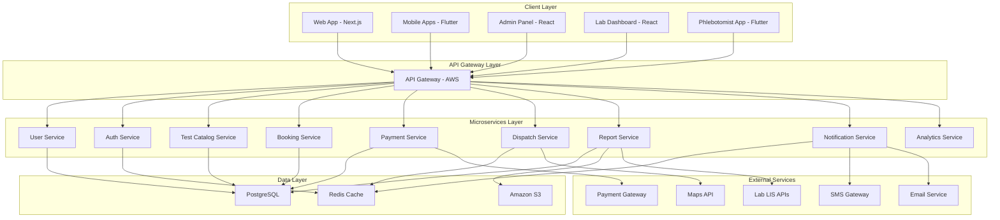

# Design Document: Health Ocean

## Overview

Health Ocean is a multi-sided marketplace platform connecting patients with diagnostic labs for home sample collection and digital report delivery. The platform operates across India's top 20 cities, facilitating the complete workflow from test discovery to report delivery.

### Core Value Proposition

- **For Patients**: Convenient home sample collection, transparent pricing, digital reports, and health history tracking
- **For Labs**: Expanded reach, automated booking management, and standardized integration
- **For Platform**: Commission-based revenue (15-40%), subscription plans, and data-driven optimization

### Key Workflows

1. **Patient Journey**: Search → Book → Pay → Track → Receive Report → Review
2. **Lab Journey**: Receive Booking → Accept Sample → Process → Upload Report → Get Paid
3. **Phlebotomist Journey**: Receive Assignment → Navigate → Collect → Deliver to Hub
4. **Admin Journey**: Onboard Partners → Manage Catalog → Monitor Operations → Resolve Disputes

## Architecture

### System Architecture

Health Ocean follows a microservices architecture deployed on AWS, with clear separation of concerns and independent scalability.



### Technology Stack

| Component | Technology | Purpose |
|-----------|------------|---------|
| **Frontend Web** | Next.js 14, React, TypeScript, Tailwind CSS | Patient web app, admin panel, lab dashboard |
| **Mobile Apps** | Flutter, Dart | Patient mobile app, phlebotomist app |
| **Backend** | Node.js 20, Express, TypeScript | Microservices implementation |
| **Database** | PostgreSQL 16, Redis 7 | Primary data storage, caching, sessions |
| **Message Queue** | RabbitMQ | Async communication between services |
| **File Storage** | Amazon S3 | Report storage, user uploads |
| **Search** | Elasticsearch | Test catalog search, analytics |
| **Infrastructure** | AWS (EC2, RDS, ElastiCache, S3) | Cloud hosting and services |
| **Monitoring** | Prometheus, Grafana | System monitoring and alerts |
| **CI/CD** | GitHub Actions, Docker | Automated deployment |

### Microservices Design

1. **User Service**: Manages patient, lab, and phlebotomist profiles
2. **Auth Service**: Handles authentication, authorization, and sessions
3. **Test Catalog Service**: Manages test database, pricing, and search
4. **Booking Service**: Handles booking creation, scheduling, and lifecycle
5. **Payment Service**: Processes payments, refunds, and commission calculations
6. **Dispatch Service**: Assigns phlebotomists, optimizes routes, tracks locations
7. **Report Service**: Manages report upload, storage, and delivery
8. **Notification Service**: Sends push, SMS, and email notifications
9. **Analytics Service**: Processes business intelligence and reporting

## Database Design

### Core Tables

```sql
-- Users table (patients, labs, phlebotomists, admins)
CREATE TABLE users (
    id UUID PRIMARY KEY DEFAULT gen_random_uuid(),
    email VARCHAR(255) UNIQUE NOT NULL,
    phone VARCHAR(20) UNIQUE NOT NULL,
    password_hash VARCHAR(255) NOT NULL,
    user_type VARCHAR(20) NOT NULL CHECK (user_type IN ('patient', 'lab', 'phlebotomist', 'admin')),
    first_name VARCHAR(100),
    last_name VARCHAR(100),
    is_active BOOLEAN DEFAULT true,
    created_at TIMESTAMP DEFAULT CURRENT_TIMESTAMP,
    updated_at TIMESTAMP DEFAULT CURRENT_TIMESTAMP
);

-- Patients table (extends users)
CREATE TABLE patients (
    id UUID PRIMARY KEY REFERENCES users(id),
    date_of_birth DATE,
    gender VARCHAR(10) CHECK (gender IN ('male', 'female', 'other')),
    blood_group VARCHAR(5),
    address JSONB, -- {street, city, state, pincode, coordinates}
    medical_history JSONB,
    subscription_id UUID,
    created_at TIMESTAMP DEFAULT CURRENT_TIMESTAMP
);

-- Labs table (extends users)
CREATE TABLE labs (
    id UUID PRIMARY KEY REFERENCES users(id),
    lab_name VARCHAR(255) NOT NULL,
    nabl_certification_number VARCHAR(100),
    certification_valid_until DATE,
    address JSONB,
    service_areas JSONB, -- Array of pincodes/cities
    contact_person VARCHAR(100),
    contact_phone VARCHAR(20),
    rating DECIMAL(3,2) DEFAULT 0.0,
    total_ratings INTEGER DEFAULT 0,
    created_at TIMESTAMP DEFAULT CURRENT_TIMESTAMP
);

-- Tests catalog
CREATE TABLE tests (
    id UUID PRIMARY KEY DEFAULT gen_random_uuid(),
    test_code VARCHAR(50) UNIQUE NOT NULL,
    name VARCHAR(255) NOT NULL,
    description TEXT,
    category VARCHAR(100),
    sample_type VARCHAR(50),
    preparation_instructions TEXT,
    fasting_required BOOLEAN DEFAULT false,
    turnaround_hours INTEGER,
    is_active BOOLEAN DEFAULT true,
    created_at TIMESTAMP DEFAULT CURRENT_TIMESTAMP
);

-- Lab-specific test pricing
CREATE TABLE lab_test_prices (
    id UUID PRIMARY KEY DEFAULT gen_random_uuid(),
    lab_id UUID REFERENCES labs(id),
    test_id UUID REFERENCES tests(id),
    base_price DECIMAL(10,2) NOT NULL,
    platform_commission DECIMAL(5,2) NOT NULL, -- 15-40%
    final_price DECIMAL(10,2) GENERATED ALWAYS AS (base_price * (1 + platform_commission/100)) STORED,
    is_available BOOLEAN DEFAULT true,
    daily_capacity INTEGER,
    UNIQUE(lab_id, test_id)
);

-- Bookings
CREATE TABLE bookings (
    id UUID PRIMARY KEY DEFAULT gen_random_uuid(),
    booking_number VARCHAR(50) UNIQUE NOT NULL,
    patient_id UUID REFERENCES patients(id),
    status VARCHAR(20) NOT NULL CHECK (status IN ('pending', 'confirmed', 'assigned', 'in_progress', 'collected', 'in_transit', 'at_lab', 'processing', 'completed', 'cancelled', 'refunded')),
    total_amount DECIMAL(10,2) NOT NULL,
    discount_amount DECIMAL(10,2) DEFAULT 0,
    final_amount DECIMAL(10,2) NOT NULL,
    payment_status VARCHAR(20) CHECK (payment_status IN ('pending', 'paid', 'failed', 'refunded')),
    scheduled_date DATE NOT NULL,
    scheduled_slot VARCHAR(20) NOT NULL, -- 'morning', 'afternoon', 'evening'
    address JSONB NOT NULL,
    created_at TIMESTAMP DEFAULT CURRENT_TIMESTAMP,
    updated_at TIMESTAMP DEFAULT CURRENT_TIMESTAMP
);

-- Booking items (multiple tests per booking)
CREATE TABLE booking_items (
    id UUID PRIMARY KEY DEFAULT gen_random_uuid(),
    booking_id UUID REFERENCES bookings(id),
    test_id UUID REFERENCES tests(id),
    lab_id UUID REFERENCES labs(id),
    price DECIMAL(10,2) NOT NULL,
    status VARCHAR(20) CHECK (status IN ('pending', 'assigned', 'collected', 'at_lab', 'processing', 'completed', 'cancelled')),
    assigned_phlebotomist_id UUID REFERENCES users(id),
    sample_barcode VARCHAR(100),
    report_url VARCHAR(500),
    created_at TIMESTAMP DEFAULT CURRENT_TIMESTAMP
);

-- Phlebotomist assignments
CREATE TABLE phlebotomist_assignments (
    id UUID PRIMARY KEY DEFAULT gen_random_uuid(),
    phlebotomist_id UUID REFERENCES users(id),
    booking_item_id UUID REFERENCES booking_items(id),
    assignment_status VARCHAR(20) CHECK (assignment_status IN ('assigned', 'en_route', 'arrived', 'collecting', 'collected', 'delivered', 'cancelled')),
    estimated_arrival TIMESTAMP,
    actual_arrival TIMESTAMP,
    collection_start TIMESTAMP,
    collection_end TIMESTAMP,
    delivery_to_hub TIMESTAMP,
    notes TEXT,
    created_at TIMESTAMP DEFAULT CURRENT_TIMESTAMP
);

-- Reports
CREATE TABLE reports (
    id UUID PRIMARY KEY DEFAULT gen_random_uuid(),
    booking_item_id UUID REFERENCES booking_items(id),
    report_url VARCHAR(500) NOT NULL,
    report_format VARCHAR(10) CHECK (report_format IN ('pdf', 'json', 'hl7')),
    uploaded_by UUID REFERENCES users(id),
    uploaded_at TIMESTAMP DEFAULT CURRENT_TIMESTAMP,
    is_critical BOOLEAN DEFAULT false,
    verification_status VARCHAR(20) CHECK (verification_status IN ('pending', 'verified', 'rejected')),
    verified_by UUID REFERENCES users(id),
    verified_at TIMESTAMP
);

-- Payments
CREATE TABLE payments (
    id UUID PRIMARY KEY DEFAULT gen_random_uuid(),
    booking_id UUID REFERENCES bookings(id),
    payment_method VARCHAR(50) NOT NULL,
    transaction_id VARCHAR(100) UNIQUE,
    amount DECIMAL(10,2) NOT NULL,
    status VARCHAR(20) CHECK (status IN ('initiated', 'success', 'failed', 'refunded')),
    gateway_response JSONB,
    refund_amount DECIMAL(10,2) DEFAULT 0,
    refund_reason TEXT,
    created_at TIMESTAMP DEFAULT CURRENT_TIMESTAMP
);

-- Notifications
CREATE TABLE notifications (
    id UUID PRIMARY KEY DEFAULT gen_random_uuid(),
    user_id UUID REFERENCES users(id),
    type VARCHAR(50) NOT NULL,
    title VARCHAR(255) NOT NULL,
    message TEXT NOT NULL,
    data JSONB,
    channel VARCHAR(20) CHECK (channel IN ('push', 'sms', 'email', 'in_app')),
    status VARCHAR(20) CHECK (status IN ('pending', 'sent', 'failed', 'read')),
    sent_at TIMESTAMP,
    read_at TIMESTAMP,
    created_at TIMESTAMP DEFAULT CURRENT_TIMESTAMP
);
```

## API Design

### REST API Endpoints

#### Authentication
- `POST /api/v1/auth/register` - User registration
- `POST /api/v1/auth/login` - User login
- `POST /api/v1/auth/logout` - User logout
- `POST /api/v1/auth/refresh` - Refresh token
- `POST /api/v1/auth/forgot-password` - Password reset request
- `POST /api/v1/auth/reset-password` - Password reset

#### Tests Catalog
- `GET /api/v1/tests` - List tests with pagination and filters
- `GET /api/v1/tests/search` - Search tests by name/category
- `GET /api/v1/tests/{id}` - Get test details
- `GET /api/v1/tests/{id}/labs` - Get labs offering this test with pricing
- `GET /api/v1/tests/categories` - List test categories

#### Bookings
- `POST /api/v1/bookings` - Create new booking
- `GET /api/v1/bookings` - List user bookings
- `GET /api/v1/bookings/{id}` - Get booking details
- `PUT /api/v1/bookings/{id}/cancel` - Cancel booking
- `GET /api/v1/bookings/{id}/track` - Track booking status
- `GET /api/v1/bookings/{id}/items` - Get booking items

#### Payments
- `POST /api/v1/payments/initiate` - Initiate payment
- `POST /api/v1/payments/verify` - Verify payment
- `POST /api/v1/payments/{id}/refund` - Request refund
- `GET /api/v1/payments/{id}` - Get payment details

#### Reports
- `GET /api/v1/reports` - List user reports
- `GET /api/v1/reports/{id}` - Get report details
- `GET /api/v1/reports/{id}/download` - Download report PDF
- `POST /api/v1/reports/{id}/share` - Generate shareable link

#### Admin Endpoints
- `POST /api/v1/admin/labs` - Create/update lab
- `POST /api/v1/admin/tests` - Create/update test
- `GET /api/v1/admin/analytics` - Get platform analytics
- `GET /api/v1/admin/disputes` - List disputes
- `POST /api/v1/admin/disputes/{id}/resolve` - Resolve dispute

#### Lab Partner Endpoints
- `GET /api/v1/lab/bookings` - List lab bookings
- `POST /api/v1/lab/bookings/{id}/accept` - Accept/reject sample
- `POST /api/v1/lab/reports` - Upload report
- `PUT /api/v1/lab/capacity` - Update lab capacity

#### Phlebotomist Endpoints
- `GET /api/v1/phlebotomist/assignments` - List assignments
- `POST /api/v1/phlebotomist/assignments/{id}/status` - Update assignment status
- `POST /api/v1/phlebotomist/location` - Update current location

### WebSocket Events

```typescript
// Real-time tracking events
interface TrackingEvent {
  type: 'phlebotomist_location' | 'booking_status' | 'report_ready';
  data: any;
  timestamp: number;
}

// Notification events
interface NotificationEvent {
  type: 'booking_confirmed' | 'phlebotomist_assigned' | 'report_uploaded';
  userId: string;
  data: any;
}
```

## Key Algorithms

### Lab Assignment Algorithm

```typescript
interface LabAssignmentInput {
  testId: string;
  patientAddress: Address;
  scheduledDate: Date;
  scheduledSlot: string;
}

interface LabAssignmentResult {
  labId: string;
  price: number;
  estimatedTurnaround: number;
  distance: number;
  rating: number;
}

async function assignLab(input: LabAssignmentInput): Promise<LabAssignmentResult> {
  // 1. Get all labs offering this test
  const labs = await getLabsByTest(input.testId);
  
  // 2. Filter by service area (city/pincode)
  const serviceAreaLabs = labs.filter(lab => 
    isInServiceArea(lab.serviceAreas, input.patientAddress)
  );
  
  // 3. Filter by capacity for scheduled date
  const availableLabs = await Promise.all(
    serviceAreaLabs.map(async lab => {
      const capacity = await getLabCapacity(lab.id, input.testId, input.scheduledDate);
      return capacity > 0 ? lab : null;
    })
  ).then(results => results.filter(Boolean));
  
  // 4. Calculate scores for each lab
  const scoredLabs = availableLabs.map(lab => {
    const distance = calculateDistance(lab.address, input.patientAddress);
    const price = getTestPrice(lab.id, input.testId);
    const rating = lab.rating;
    const turnaround = getTurnaroundTime(lab.id, input.testId);
    
    // Weighted scoring
    const score = (
      (0.35 * normalizePrice(price)) +
      (0.25 * normalizeDistance(distance)) +
      (0.20 * rating) +
      (0.20 * normalizeTurnaround(turnaround))
    );
    
    return {
      labId: lab.id,
      price,
      distance,
      rating,
      estimatedTurnaround: turnaround,
      score
    };
  });
  
  // 5. Select best lab
  const bestLab = scoredLabs.sort((a, b) => b.score - a.score)[0];
  
  // 6. Reserve capacity
  await reserveLabCapacity(bestLab.labId, input.testId, input.scheduledDate);
  
  return {
    labId: bestLab.labId,
    price: bestLab.price,
    estimatedTurnaround: bestLab.estimatedTurnaround,
    distance: bestLab.distance,
    rating: bestLab.rating
  };
}
```

### Phlebotomist Dispatch Algorithm

```typescript
interface DispatchInput {
  bookingId: string;
  patientAddress: Address;
  scheduledTime: Date;
  testRequirements: string[];
}

interface DispatchResult {
  phlebotomistId: string;
  estimatedArrival: Date;
  route: Route;
}

async function dispatchPhlebotomist(input: DispatchInput): Promise<DispatchResult> {
  // 1. Get available phlebotomists in area
  const availablePhlebotomists = await getAvailablePhlebotomists(
    input.patientAddress,
    input.scheduledTime
  );
  
  // 2. Filter by skills (if test requires special skills)
  const skilledPhlebotomists = availablePhlebotomists.filter(phleb =>
    hasRequiredSkills(phleb.skills, input.testRequirements)
  );
  
  // 3. Get current assignments for optimization
  const currentAssignments = await getCurrentAssignments(skilledPhlebotomists);
  
  // 4. Calculate optimal assignment
  const assignmentsWithRoutes = skilledPhlebotomists.map(phleb => {
    const currentRoute = currentAssignments[phleb.id] || [];
    const newRoute = optimizeRoute([...currentRoute, input.patientAddress]);
    
    const travelTime = calculateRouteTime(newRoute);
    const arrivalTime = addMinutes(new Date(), travelTime);
    
    return {
      phlebotomistId: phleb.id,
      currentRoute,
      newRoute,
      travelTime,
      arrivalTime,
      routeEfficiency: calculateEfficiency(newRoute)
    };
  });
  
  // 5. Select best phlebotomist (minimize travel time, maximize efficiency)
  const bestAssignment = assignmentsWithRoutes.sort((a, b) => {
    // Prioritize arrival within scheduled window
    const aInWindow = isWithinWindow(a.arrivalTime, input.scheduledTime);
    const bInWindow = isWithinWindow(b.arrivalTime, input.scheduledTime);
    
    if (aInWindow && !bInWindow) return -1;
    if (!aInWindow && bInWindow) return 1;
    
    // Then prioritize efficiency
    return b.routeEfficiency - a.routeEfficiency;
  })[0];
  
  // 6. Update phlebotomist route
  await updatePhlebotomistRoute(bestAssignment.phlebotomistId, bestAssignment.newRoute);
  
  return {
    phlebotomistId: bestAssignment.phlebotomistId,
    estimatedArrival: bestAssignment.arrivalTime,
    route: bestAssignment.newRoute
  };
}
```

## UI/UX Design

### Design System

**Colors:**
- Primary: Ocean Blue (#0066CC) - Trust, health, professionalism
- Secondary: Teal (#00B4B4) - Freshness, cleanliness
- Accent: Coral (#FF6B6B) - Urgency, alerts
- Neutral: Gray (#F8F9FA) - Backgrounds
- Text: Dark Gray (#2D3748) - Readability

**Typography:**
- Headings: Inter Bold
- Body: Inter Regular
- Monospace: JetBrains Mono (for medical data)

**Components:**
- Responsive card layouts
- Progress indicators for booking status
- Map integration for tracking
- Accessible form controls
- Mobile-first navigation

### Key Screens

1. **Home/Landing Page**
   - Test search bar
   - Featured tests and packages
   - How it works section
   - Trust indicators (NABL certified, secure)

2. **Test Search Results**
   - Filter panel (category, price, labs)
   - Grid/list view toggle
   - Sort options (price, rating, distance)
   - Add to cart functionality

3. **Booking Flow**
   - Test selection summary
   - Patient details form
   - Address and scheduling
   - Payment gateway
   - Confirmation screen

4. **Tracking Dashboard**
   - Real-time phlebotomist location
   - Status timeline
   - Estimated arrival time
   - Contact options

5. **Reports Dashboard**
   - Chronological report list
   - Health trends visualization
   - Report viewer with zoom
   - Sharing options

6. **Admin Dashboard**
   - Real-time metrics
   - Lab management
   - Dispute resolution
   - Analytics reports

## Security & Compliance

### Data Protection
- **Encryption**: AES-256 for data at rest, TLS 1.3 for data in transit
- **Authentication**: JWT tokens with short expiry, refresh tokens
- **Authorization**: Role-based access control (RBAC)
- **Audit Logging**: All data access and modifications logged
- **Data Retention**: Medical records retained for 5+ years as per regulations

### Compliance Requirements
- **NABL Certification**: Partner only with NABL certified labs
- **HIPAA Equivalent**: Implement Indian medical data privacy standards
- **PCI DSS**: Secure payment processing
- **GDPR Principles**: Data minimization, purpose limitation, consent

### Security Measures
1. **Input Validation**: Sanitize all user inputs
2. **SQL Injection Prevention**: Parameterized queries
3. **XSS Protection**: Content Security Policy (CSP)
4. **Rate Limiting**: Prevent abuse of APIs
5. **Regular Security Audits**: Quarterly penetration testing

## Deployment & Infrastructure

### AWS Infrastructure
```
Region: ap-south-1 (Mumbai)
VPC with public/private subnets
EC2 Auto Scaling Groups for microservices
RDS PostgreSQL with read replicas
ElastiCache Redis for caching
S3 for report storage
CloudFront for CDN
Route 53 for DNS
CloudWatch for monitoring
```

### CI/CD Pipeline
1. **Development**: Feature branches, pull requests
2. **Testing**: Automated tests, security scans
3. **Staging**: Environment mirroring production
4. **Production**: Blue-green deployment, canary releases

### Monitoring & Alerting
- **Application Metrics**: Response times, error rates, throughput
- **Business Metrics**: Bookings, revenue, conversion rates
- **Infrastructure Metrics**: CPU, memory, disk, network
- **Alerting**: PagerDuty integration for critical issues

## Scalability Considerations

### Horizontal Scaling
- Stateless microservices
- Database read replicas
- Redis cluster for distributed caching
- S3 for unlimited file storage

### Performance Optimization
- CDN for static assets
- Database indexing and query optimization
- API response caching
- Background job processing for non-critical tasks

### Geographic Expansion
- Multi-region deployment for reduced latency
- Localized content and pricing
- Regional compliance variations

## Testing Strategy

### Unit Testing
- Test each microservice independently
- Mock external dependencies
- Achieve 80%+ code coverage

### Integration Testing
- Test service-to-service communication
- Database integration tests
- Third-party API integration tests

### End-to-End Testing
- Complete user journey testing
- Cross-browser and cross-device testing
- Performance and load testing

### Property-Based Testing
- Test business logic with random inputs
- Verify invariants hold across all inputs
- Edge case discovery through generated data

## Correctness Properties

### Booking Properties
1. **Validates: Requirements 3.1, 3.3**
   - Property: A booking can only be created with valid patient, test, and address information
   - Test: For all valid booking inputs, the system creates a booking with unique ID and correct status

2. **Validates: Requirements 3.2, 3.4**
   - Property: Scheduled collection time must be within available slots (6 AM to 9 PM)
   - Test: For all booking attempts, scheduled time is validated and rejected if outside bounds

3. **Validates: Requirements 3.3, 3.7**
   - Property: Lab assignment considers availability, distance, price, and capacity
   - Test: For all booking requests, assigned lab has capacity and is in service area

### Payment Properties
4. **Validates: Requirements 4.1, 4.2, 4.3**
   - Property: Payment processing is atomic - either fully succeeds or fully fails
   - Test: For all payment attempts, booking status and payment status remain consistent

5. **Validates: Requirements 4.6, 4.7**
   - Property: Discount validation and application is consistent
   - Test: For all discount codes, validation logic produces same result for same inputs

### Dispatch Properties
6. **Validates: Requirements 5.1, 5.2, 5.4**
   - Property: Phlebotomist assignment optimizes routes and considers workload
   - Test: For all dispatch requests, assigned phlebotomist is available and route is efficient

7. **Validates: Requirements 5.3, 5.6**
   - Property: Failed assignments are handled gracefully
   - Test: When no phlebotomist available, system notifies admin and marks booking appropriately

### Sample Collection Properties
8. **Validates: Requirements 6.1, 6.4, 6.5**
   - Property: Sample collection workflow maintains chain of custody
   - Test: For all sample collections, status transitions follow valid sequence with timestamps

9. **Validates: Requirements 6.2, 6.3**
   - Property: Barcode scanning ensures sample identification accuracy
   - Test: Sample barcodes are unique and correctly associated with booking items

### Report Properties
10. **Validates: Requirements 8.4, 8.5, 8.6**
    - Property: Report upload and delivery maintains data integrity
    - Test: Uploaded reports are correctly associated with bookings and delivered to patients

11. **Validates: Requirements 8.7, 23.1, 23.2**
    - Property: Turnaround time tracking and critical result notification
    - Test: Reports are delivered within promised timeframe, critical results trigger immediate alerts

### Security Properties
12. **Validates: Requirements 1.5, 17.1, 17.2**
    - Property: Patient data is encrypted and access controlled
    - Test: Unauthorized access attempts are blocked, encrypted data remains secure

13. **Validates: Requirements 17.3, 17.4**
    - Property: Role-based access control is consistently enforced
    - Test: Users can only access resources permitted by their role

### Business Logic Properties
14. **Validates: Requirements 14.1, 14.2, 14.3**
    - Property: Cancellation policy is consistently applied
    - Test: Refund amounts match policy based on cancellation timing

15. **Validates: Requirements 15.1, 15.5, 15.6**
    - Property: Rating system prevents abuse and maintains integrity
    - Test: Users can only rate completed bookings, duplicate ratings are prevented

## Risk Mitigation

### Technical Risks
1. **Lab Integration Failures**: Fallback to manual upload, alert monitoring
2. **Payment Gateway Downtime**: Queue payments, retry logic, manual processing
3. **Phlebotomist No-shows**: Backup assignment, penalty system, customer compensation
4. **Sample Logistics Delays**: Real-time tracking, contingency routing, temperature monitoring

### Business Risks
1. **Regulatory Changes**: Compliance monitoring, legal counsel engagement
2. **Competition**: Continuous innovation, customer loyalty programs
3. **Market Adoption**: Targeted marketing, referral programs, partnerships
4. **Financial Sustainability**: Revenue diversification, cost optimization

## Success Metrics

### Key Performance Indicators (KPIs)
1. **Booking Conversion Rate**: Search to booking completion
2. **Customer Satisfaction Score**: Based on ratings and reviews
3. **Report Turnaround Time**: Actual vs promised delivery time
4. **Phlebotomist Efficiency**: Collections per hour, travel time optimization
5. **Platform Uptime**: System availability percentage
6. **Revenue Growth**: Month-over-month booking value increase

### Quality Metrics
1. **Test Accuracy**: Report accuracy compared to lab standards
2. **Data Security**: Security audit results, breach incidents
3. **System Performance**: API response times, page load speeds
4. **User Engagement**: Daily active users, feature adoption rates

## Future Enhancements

### Phase 2 (3-6 months)
- AI-powered test recommendations
- Doctor consultation integration
- Insurance claim processing
- Chronic disease management dashboard

### Phase 3 (6-12 months)
- Predictive health analytics
- Wearable device integration
- Telemedicine capabilities
- International expansion

### Phase 4 (12+ months)
- Clinical trial matching
- Genetic testing integration
- Hospital EHR integration
- AI-assisted diagnosis support

## Conclusion

Health Ocean's design provides a scalable, secure, and user-friendly platform for lab test bookings. The microservices architecture allows independent scaling of components, while the comprehensive database schema supports complex business logic. The UI/UX design prioritizes accessibility and responsiveness across all devices.

The platform addresses key challenges in the diagnostic industry through automated lab assignment, optimized phlebotomist dispatch, and secure report delivery. Compliance with medical regulations and data privacy standards ensures trust and reliability.

With the foundation established in this design, Health Ocean is positioned to become a leading player in India's digital health market, starting with the top 20 cities and expanding nationwide.